# Odds: Prediction Market Platform

A web-based prediction market where users trade YES/NO shares on real-world events. Think "Will Candidate A win the 2028 presidential election?". If you think yes, buy YES shares. If someone disagrees, they buy NO. When the event resolves, winners get paid.


## How It Works

1. **Browse markets**: see what events people are predicting on
2. **Pick a side**: buy YES or NO shares at a price you choose
3. **Prices move**: as more people trade, the price reflects the crowd's probability estimate
4. **Market resolves**: a resolver verifies the real-world outcome
5. **Winners get paid**: $1.00 per winning share, losers get nothing

The price of a share equals the crowd's implied probability. YES at $0.70 means the crowd thinks there's a 70% chance it happens.

## System Architecture Overview

This project uses **service-based architecture** with 6 independent services sharing one PostgreSQL database. Services communicate via REST APIs, with an Nginx API gateway routing all frontend requests to the correct service. Real-time updates use WebSocket (Socket.io).

I chose this over a monolith (too coupled, no fault isolation) and microservices (too complex for financial transactions that need ACID guarantees from a shared database).

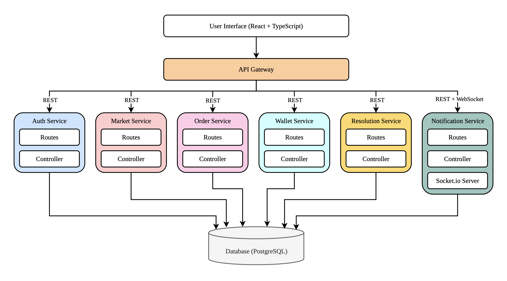

### Services

| Service | Port | Responsibility |
|---|---|---|
| Auth | 3000 | Register, login, JWT tokens, HTTP-only cookies |
| Market | 3001 | Create/edit/void markets, categories, search, pagination |
| Order | 3002 | Place orders, matching engine, price updates, trade history |
| Wallet | 3003 | Deposits, withdrawals, escrow locking/releasing, payouts |
| Resolution | 3004 | Verify outcomes, trigger payouts, notify participants |
| Notification | 3005 | Real-time alerts via REST + WebSocket (Socket.io) |

### Inter-Service Communication

| From | To | Method | Purpose |
|---|---|---|---|
| Order | Wallet | REST | Lock escrow on order placement, release on cancel |
| Order | Notification | REST | Alert traders when a trade matches |
| Resolution | Wallet | REST | Pay winners when market resolves |
| Resolution | Notification | REST | Alert participants about the outcome |
| Market | Wallet | REST | Refund everyone when a market is voided |
| Market | Notification | REST | Announce new/voided markets |
| Notification | Frontend | WebSocket | Push live price updates, trade alerts, notifications |

Internal service-to-service calls use a shared `X-Service-Key` header for authentication.

## User Roles & Permissions

| Role | Permissions |
|---|---|
| **User** | Browse markets, deposit/withdraw credits, buy YES/NO shares, view portfolio and order history, receive notifications |
| **Admin** | All user permissions + create/edit/void markets, manage users and roles, assign resolvers to markets |
| **Resolver** | All user permissions + verify real-world outcomes and submit resolution verdicts for assigned markets |

Access control is enforced at:
- **Backend**: JWT middleware + `requireRole()` middleware on protected routes
- **Frontend**: `ProtectedRoute` component redirects unauthorized users

## Technology Stack

| Layer | Technology |
|---|---|
| Frontend | React 19, TypeScript, Vite, Tailwind CSS v4, TanStack Query, Recharts, Socket.io Client |
| Backend | Bun, Express, Prisma ORM |
| Database | PostgreSQL 18 |
| Real-time | Socket.io |
| Auth | JWT + HTTP-only cookies + role-based access control |
| API Gateway | Nginx |
| Deployment | Docker + Docker Compose |

## Installation & Setup

### Prerequisites

- [Docker](https://docker.com) and Docker Compose
- [Bun](https://bun.sh) (v1.0+): only needed for local development

### Getting Started

```bash
git clone https://github.com/pannlnwza/prediction-market.git
cd prediction-market
cp .env.example .env
```

### Environment Variables

| Variable | Description | Default |
|---|---|---|
| `DB_NAME` | PostgreSQL database name | `prediction_market` |
| `DB_USER` | PostgreSQL username | `postgres` |
| `DB_PASSWORD` | PostgreSQL password | `postgres` |
| `JWT_SECRET` | Secret key for signing JWT tokens | `your-jwt-secret-change-in-production` |
| `SERVICE_KEY` | Shared key for inter-service REST calls | `internal-service-key-change-in-production` |

The defaults in `.env.example` work out of the box for development.

## How to Run

### With Docker (recommended)

```bash
docker compose up --build
```

The database tables and seed data are created automatically on first startup. Open **http://localhost** in your browser (port 80). Nginx routes all requests to the correct service internally.

### Local Development

You need a running PostgreSQL instance. Either use Docker or your own local PostgreSQL, then update the `.env` file with your database credentials.

```bash
# Option A: start PostgreSQL with Docker
docker compose up postgres -d

# Option B: use your own PostgreSQL
# Just make sure DB_NAME, DB_USER, and DB_PASSWORD in .env match your setup
```

```bash
# Terminal 1: backend
cd backend
bun install
bun run db:setup    # creates tables, generates Prisma client, seeds data
bun run dev         # starts all 6 services

# Terminal 2: frontend
cd frontend
bun install
bun run dev
```

Open **http://localhost:5173**. The Vite dev server proxies API requests to the backend services automatically.

### Running Tests

```bash
cd backend
bun run test              # run all tests
bun run test:coverage     # run with coverage report
```

### Seed Accounts

| Email | Password | Role |
|---|---|---|
| admin@example.com | admin123 | Admin |
| resolver@example.com | resolver123 | Resolver |
| user@example.com | user123 | User |
| bob@example.com | bob123 | User |
| charlie@example.com | charlie123 | User |

The seed creates 36 markets across 6 categories with trade history.


## Screenshots

### Homepage
| Desktop |
|---|
| 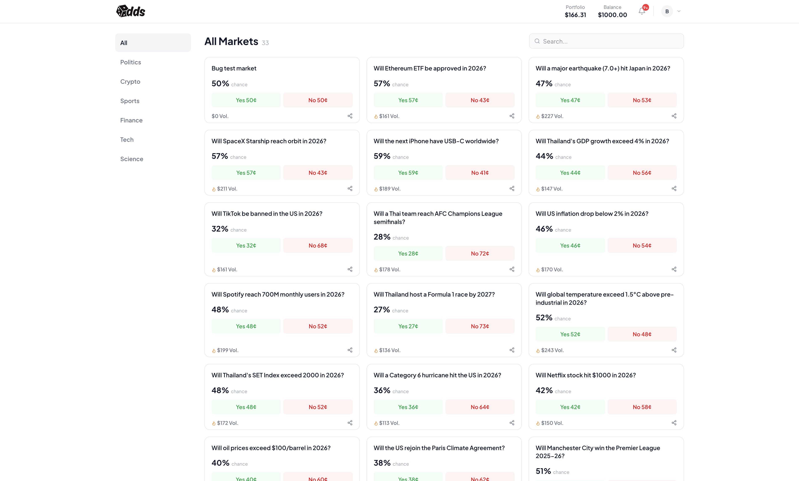 |

### Market Detail
| Market Detail |
|---|
| 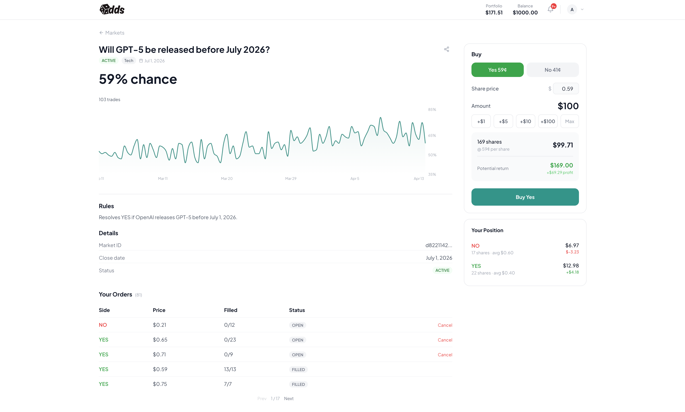 |

### Portfolio
| Positions | Order History |
|---|---|
| 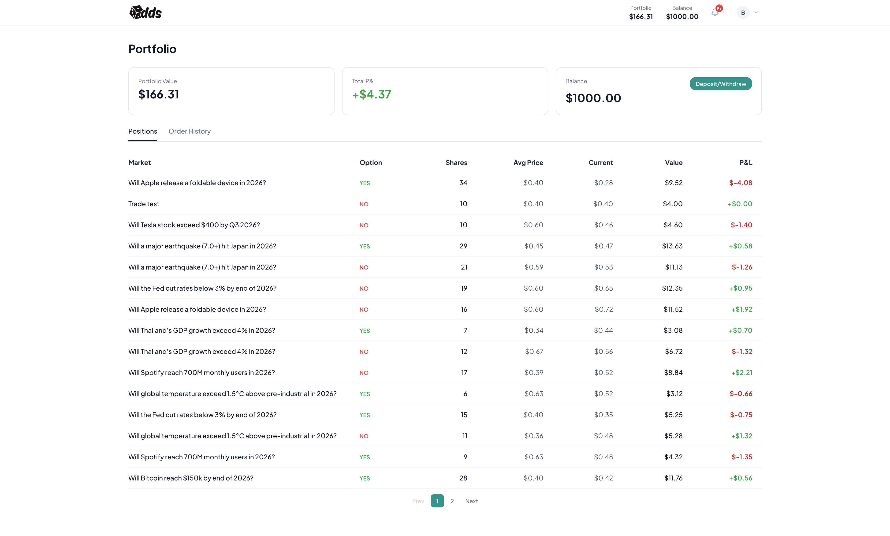 | 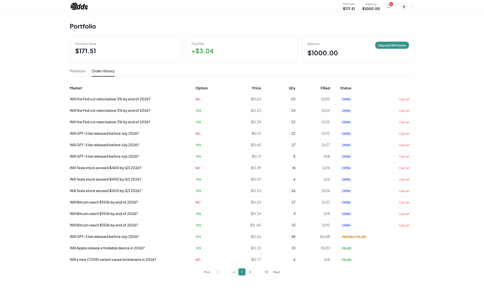 |

### Admin Panel
| Markets Management | User Management |
|---|---|
| 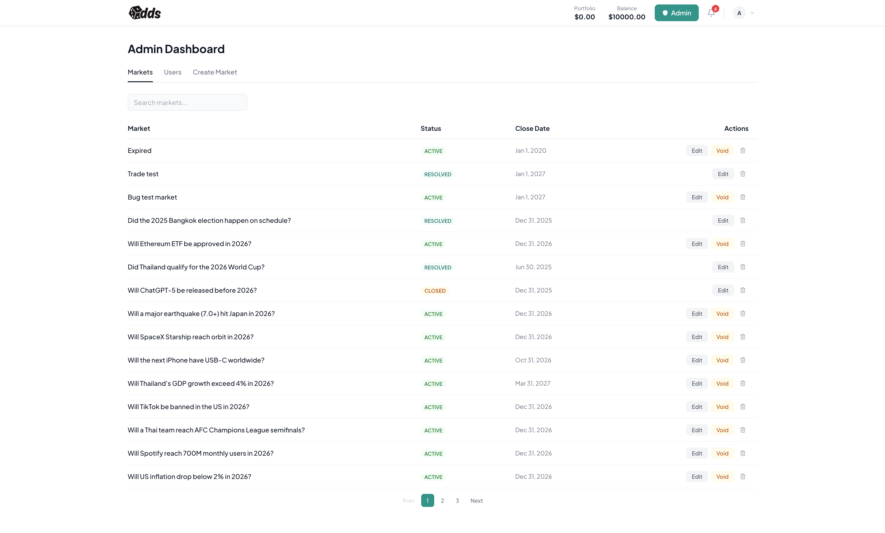 | 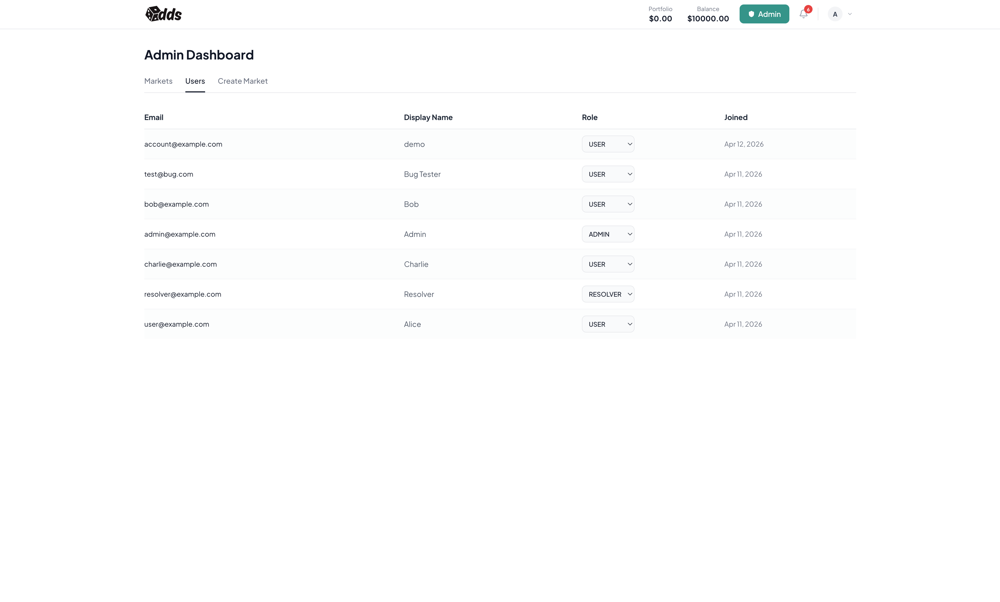 |

| Create Market |
|---|
| 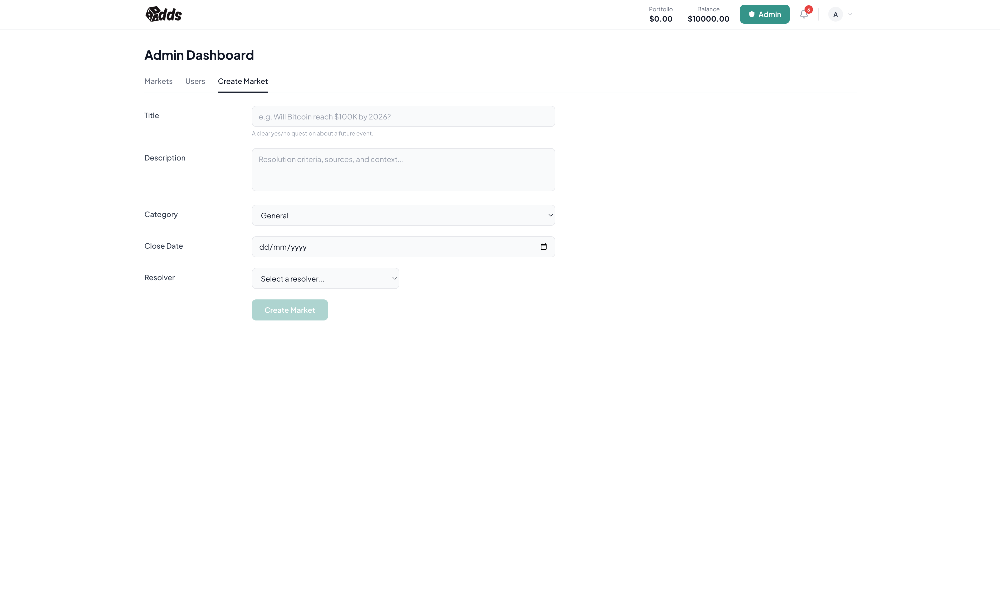 |

### Wallet & Notifications
| Wallet Modal | Notifications |
|---|---|
| 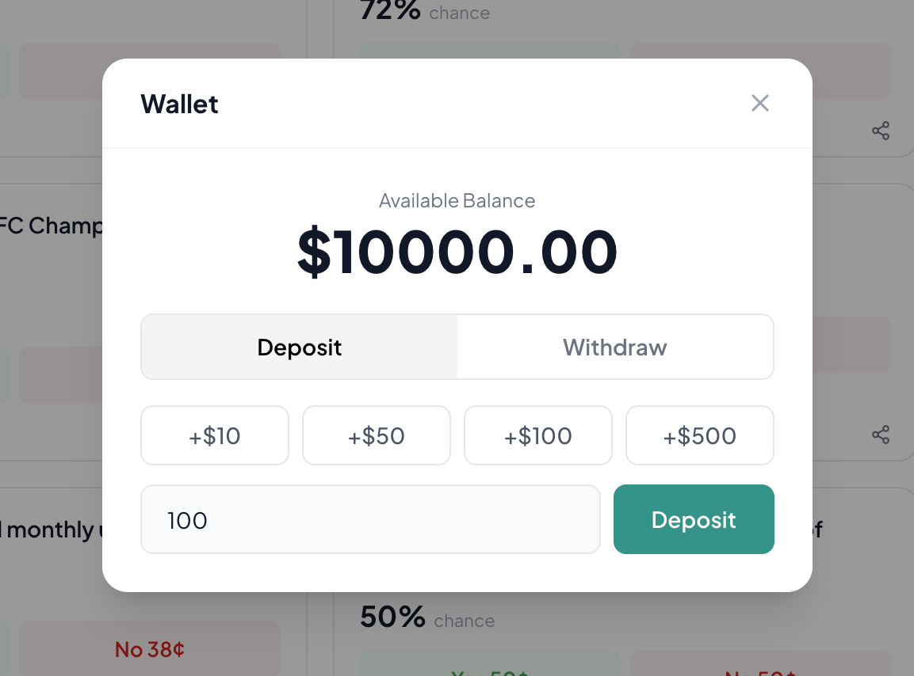 | 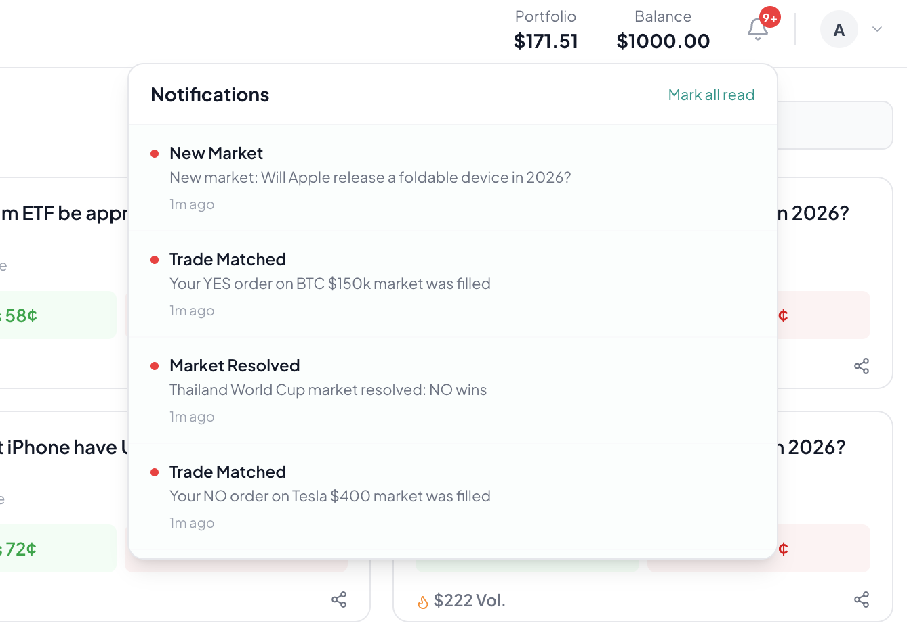 |

### Authentication
| Login | Register |
|---|---|
|  | 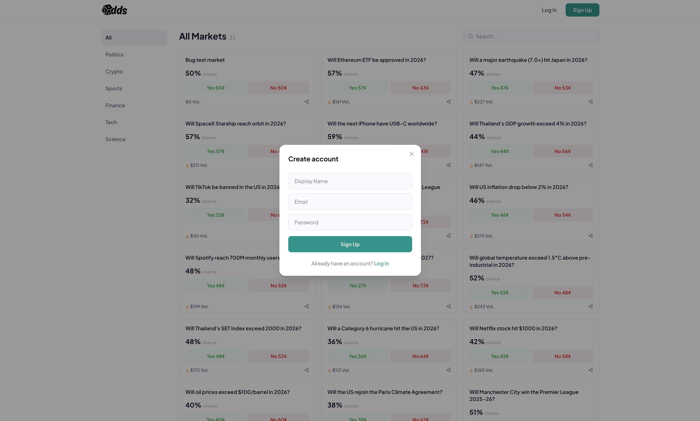 |

